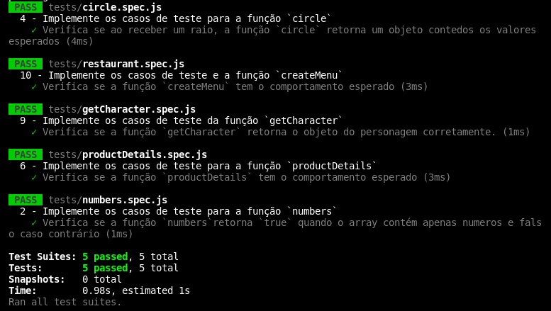

# Projeto Trybe - JS Unit Test

Implementação de várias funções para atender aos requisitos propostos e/ou testes unitários para garantir que as implementações das funções estão corretas.

#### Habilidades desenvolvidas:
- Escrever testes unitários para funções utilizando o módulo Jest do NodeJS para verificar o correto funcionamento dessas funções;
- A partir de testes já implementados, escrever funções de forma que elas atendam aos testes propostos;
- Escrever testes e funções utilizando uma abordagem de desenvolvimento orientado a testes.

#### Print da aplicação:

